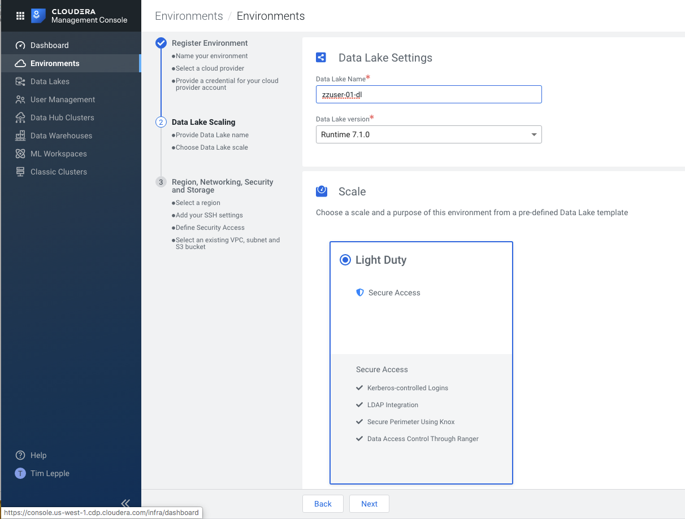
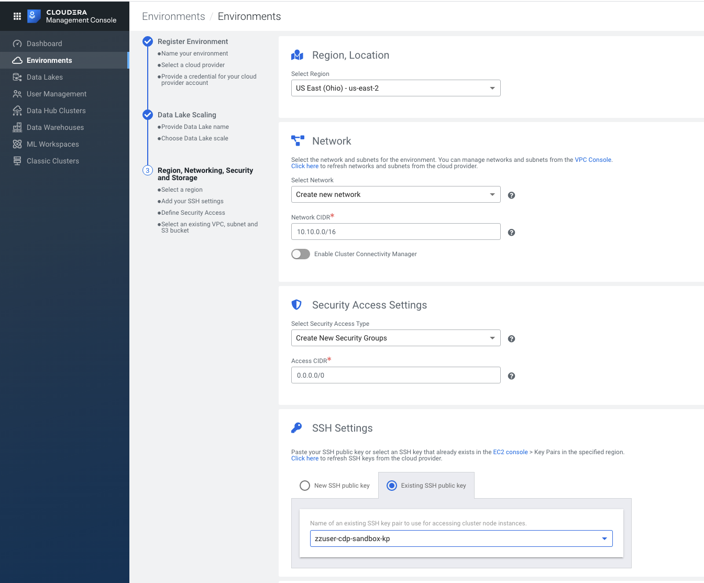

#  CDP Sandbox - Create New Environment 

---
---
### Notes:
---

*  The below videos were recorded in 30 second segments to keep file sizes small (a requirement from github).
*  Follow the instructions in order.

---
---

1.  Navigate to the CDP Sandbox Management Console and click the blue button `Register Environment`:

*  Environment Name --> `<your-owner-name>-01`
*  Credential Name  --> `<your-owner-name>-sandbox-cred`

---

---

2.  Copy the JSON for the `Create Cross-account Access Policy` and open AWS console in IAM Service and create a new policy:

*  Cross Account Policy Name -->  `<your-owner-name>-crossaccount-policy`

---

---

3. Copy the `Service Manager Account ID` for the `Create Cross-account Access Role` from the CDP Console and open AWS console in IAM service and create a new role: 

---
    A.  Create the Crossaccount Role

---
    B.  Associate the Crossaccount Role to the Crossaccount Policy

---

    C.  Associate the `<your-owner-name>-crossaccount-role ARN` in the CDP Console

---

4. Complete the screen for `Data Lake Settings` and click the `Next` button.

---

5. Complete the CDP Environment settings for `Region, Networking, Security and Storage` 

---

6.  Create a Key Pair in the EC2 Service

---
---

####  Return to setup steps:  [Creating your IAM roles from terraform](https://github.com/tlepple/horizon-public/blob/master/aws_readme.md)

