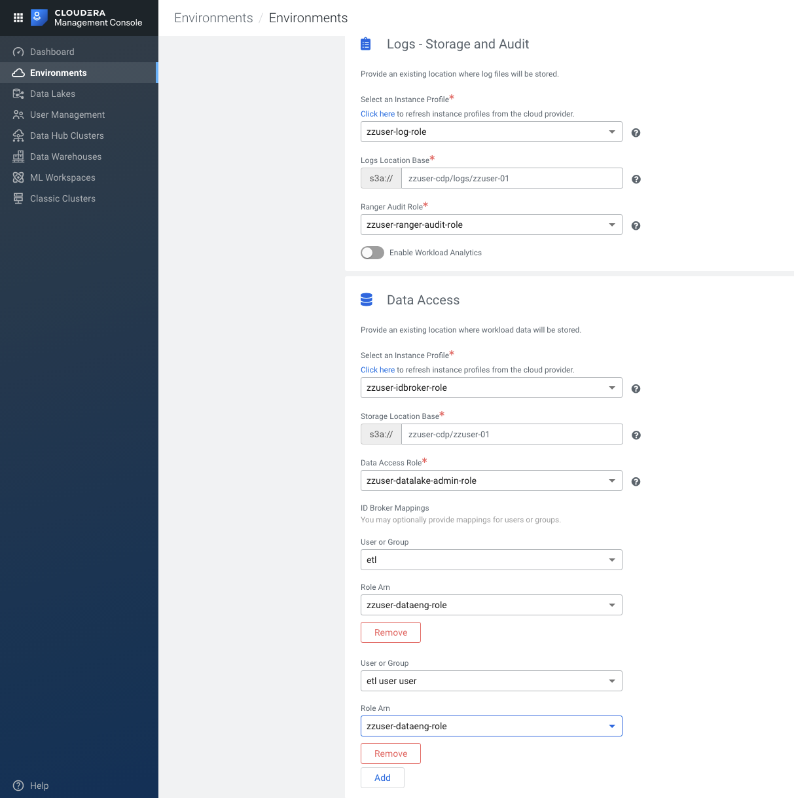
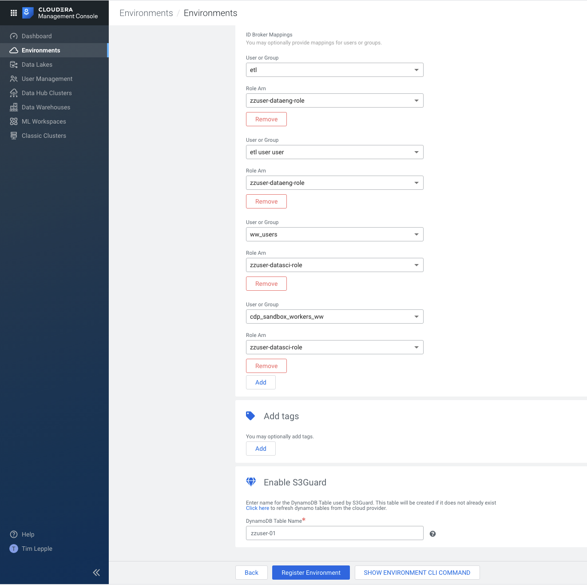
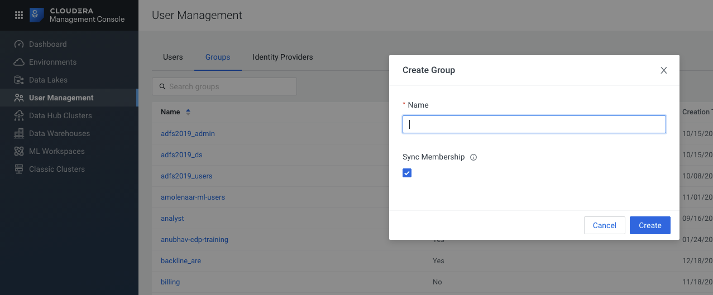
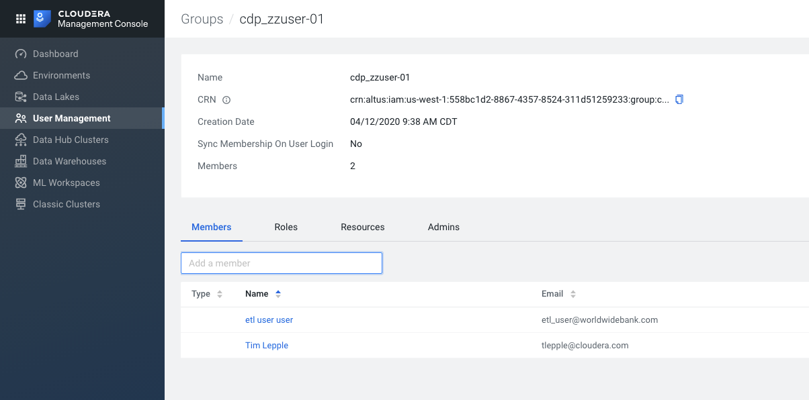

#  CDP Sandbox - Create New Environment 

---
---
### Notes:
---

*  The below videos were recorded in 30 second segments to keep file sizes small (a requirement from github).
*  Follow the instructions in order.

---
---

1.  Navigate to the CDP Sandbox Management Console and click the blue button `Register Environment`:

*  Environment Name --> `<your-owner-name>-01`
*  Credential Name  --> `<your-owner-name>-sandbox-cred`

---

---

2.  Copy the JSON for the `Create Cross-account Access Policy` and open AWS console in IAM Service and create a new policy:

*  Cross Account Policy Name -->  `<your-owner-name>-crossaccount-policy`

---

---

3. Copy the `Service Manager Account ID` for the `Create Cross-account Access Role` from the CDP Console and open AWS console in IAM service and create a new role: 

---
    A.  Create the Crossaccount Role

---
    B.  Associate the Crossaccount Role to the Crossaccount Policy

---

    C.  Associate the `<your-owner-name>-crossaccount-role ARN` in the CDP Console

---

4. Complete the screen for `Data Lake Settings` and click the `Next` button.

---

5. Complete the CDP Environment settings for `Region, Networking, Security and Storage` 

---

6.  To complete the setup click the `Register Environment` button

*  This step will take about 40 minutes if all goes smoothly...
*  You can follow the status from the CDP Console Managment Console --> Environments

---

7. Create Admin group in CDP Console and associate to your enviroments

*  CDP Sandbox --> Management Console --> User Management --> Groups --> Create Group
*  Create the group with the name `cdp_<your env name>`  ie. `cdp_zzuser-01`.  Uncheck `Sync Membership`

---

8.  Add your user name as a member of this group as well as  user `etl user user` 

*  The `Members` in the list were populated from your `Okta Credentials`
*  For a customer this would be integrated with their AD or LDAP system.

---
---

#  Import Note to keep our cloud costs under control.

*  ** Do NOT leave your Environment running over night**
*  You can shut it down from the `Actions` Menu.
*  If you are done with the Env, please delete it.
*  They will reap these Enviroments every week.

